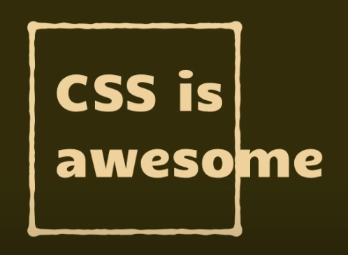

# Css trong React


## Global CSS trong SPA

Vì là SPA nên cần phải quản lý css chặc chẽ để không bị override lẫn nhau.

React có một khuyết điểm so với các SPA framework khác đó là css không được scoped theo component, hay còn gọi là css trong React là global scoped.

> Scoped CSS nghĩa là CSS cái nào thì chỉ tác động cái đó thôi, không ảnh hưởng đến các component khác.

[Demo](https://codesandbox.io/s/scoped-css-0e8lge?file=/src/Cart/cart.css)


Ở VD trên ta thấy được 2 Component `Cart` và `Product` đều có chung 1 clas container nhưng lại khác nhau ở thông số `max-width`. Bật F12 lên các bạn sẽ thấy class container bị ghi đè CSS.

Vậy nên cần phải dùng các thư viện ngoài để giải quyết vấn đề này

> Về phía [Angular](https://material.angular.io/)
> và [Vue](https://vuejs.org/), để khắc phục nhược điểm trên ngoài tên class họ còn đính kèm thêm các đoạn mã gerenate dự theo component nên chắc chắn không bị trùng khi CSS


## CSS, SCSS

Vì nó không scoped nên nếu import css, scss thì nên dùng cho [reset css](https://viblo.asia/p/reset-css-va-su-dung-reset-css-djeZ10e8KWz) hay css global.

## Inline CSS

[DEMO](https://codesandbox.io/s/scoped-inline-89yj9p?file=/src/Product/Product.jsx)
Dùng trong trường hợp chỉ css nhẹ, css dựa vào điều kiện. Không khuyến khích css tất cả bằng inline css

Nhược điểm của Inline CSS

- Không style được cho các [pseudo class](hhttps://www.w3schools.com/css/css_pseudo_classes.asp), các trường hợp của reponsive media query, CSS animation keyframe không sử dụng được
- Sau khi load web có kèm theo các thẻ style inline khá khó chịu nếu CSS nhiều thuộc tính
- Gặp khó khăn trong vấn đề bảo trì sản phẩm (vì tính độ ưu tiên, code dài dòng trên HTML)

## Atomic CSS

Nổi trội nhất trong trường phái `Atomic CSS` có [Tailwindcss](https://tailwindcss.com/) (Khá giống Bootstrap)


Trường phái mới, dùng hay nhưng cần phải học thuộc tên class khá nhiều và cần thời gian làm quen.

Ưu điểm:

- Giúp mọi người bỏ qua vấn đề đặt tên CSS, chỉ cần ghi nhớ tên thuộc tính CSS
- Code quen thì tốc độ code tăng đáng kể do tất cả chỉ viết trên mark up
- Perf tốt do dùng lại được nhiều class
- Ít đến không có css thừa đưa xuống client

Nhược điểm:

- Làm cho HTML nhìn khá là rối (có thể khắc phục chính bằng các component-based library như react)
- Phải học thuộc và làm quen các tên class trước sau đấy mới làm việc nhanh được


## CSS in JS


Nổi trội nhất `Styled Component`
[Hướng dẫn cài đặt ](https://styled-components.com/docs/basics#motivation)

```sh
# with npm

npm install styled-components

# with yarn

yarn add styled-components
```

### Các cách thường sử dụng `Styled Component`

1. CSS cho một đối tượng nào đó, gỉa sử muốn style cho thẻ `h1` và `<section>`

```JSX
// Gỉa sử muốn style cho thẻ <h1>
const Title = styled.h1`
  font-size: 1.5em;
  text-align: center;
  color: #BF4F74;
`;

// Tạo style cho thẻ <section>
const Wrapper = styled.section`
  padding: 4em;
  background: papayawhip;
`;

// Sử dụng Title và Wrapper giống như bất kỳ thành phần React nào khác
render(
  <Wrapper>
    <Title>
      Hello World!
    </Title>
  </Wrapper>
);
```

2. Ngoài ra còn có thể style cho một component

B1. Khởi tạo Button Component với prop là `isShow`, sau đó tiến hành gọi Component

```jsx
function Button({ isShow }) {
  return (
    <div className='buttons'>
      <button
        className='button-item'
        style={{
          backgroundColor: 'yellowgreen',
          display: isShow ? 'inline-block' : 'none',
        }}
      >
        Click Button
      </button>
    </div>
  );
}

export default function StylePropsProps() {
  return (
    <div>
      <Button isShow={true} />
    </div>
  );
}
```

KQ hiển thị


B2. Tiến hành style. Chú ý: Khi chúng ta style cho Component thì
thay vì sử dụng dấu chấm `styled.h1` thì chúng ta sử dụng `ngoặc tròn ()`

```jsx
const StyledButton = styled(Button)`
  display: flex;
  justify-content: center;
`;
```

Lúc này ở Component Button ta truyền props className vào cho button để nhận CSS `className`

```JSX
function Button({ isShow , className }) {
  return (
    <div className={className}>
      <button
      ...
```

Đổi

```JSX
export default function StylePropsProps() {
  return (
    <div>
      <Button isShow={true}/>
      ...
```

thành

```jsx
export default function StylePropsProps() {
  return (
    <div>
       <StyledButton isShow={true} />
      ...
```

> Nếu như muốn thêm class custom kèm theo class của styled Component, ta có thể thêm vào nư sau

```jsx
function Button({ isShow , className }) {
  return (
    <div className={className} + 'dynamic-class'>
      <button
      ...
```

- Tạo dynamic style với props

KQ: class đã được thêm style + prefix ở các trình duyệt (khá xịn)


[Codesanbox](https://codesandbox.io/s/scoped-inline-89yj9p?file=/src/Style-Component/StylePropsComponent.jsx)

- Có thể sử dụng `props` theo cách sau

```jsx
<StyledButton isShow={true} primary />

-------------

const StyledButton = styled(Button)`
  display: flex;
  justify-content: center;
  background-color: ${props => props.primary ? 'orange' : 'white' }
`;

```

[Codesanbox](https://codesandbox.io/s/extend-styled-hrvgyj?file=/src/Style-Component/StylePropsComponent.jsx)

3. Tính kế thừa

Gỉa sử ta có một styled Container

```jsx
const Container = styled.div`
  max-width: 1400px;
  margin: auto;
  padding-left: 1rem;
  padding-right: 1rem;
`;
```

Bây giờ làm thế nào để tạo một styled Component có các style giống vs Container nhưng có một số tùy biến. Giờ là lúc sử dụng tính kế thừa của nó

```jsx
const ContainerExtend = styled(Container)`
  max-width: 1000;
`;
```

KQ


[Codesanbox](https://codesandbox.io/s/scoped-inline-89yj9p?file=/src/Style-Component/StylePropsComponent.jsx)

\* CODE DEMO \*

> Chúng ta có thể tạo một file `JS` để lưu trữ các Style, sau đó Export ra sử dung như một function

Ưu điểm

- đầy đủ sức mạnh của css
- linh hoạt: dùng được js để biến đổi css
- style gắn liền với component nên k cần quan tâm đến class

Nhược điểm:

- phải setup thêm để dùng
- có runtime nên ảnh hưởng nhất định đến perf
- tăng bundle size
- Các class tạo ra theo chuỗi ngẫu nhiên -> Khó khăn cho việc các bạn mới

## CSS module


[Tài liệu](https://create-react-app.dev/docs/adding-a-css-modules-stylesheet/)

```CSS
.flex {
  display: flex;
  justify-content: center;
}

```

```jsx
import './cart.css';
import styles from '../app.module.css';

export default function Cart() {
  return (
    <div className='container'>
      <h2>Cart</h2>
      <div className={styles.flex}>
        <p>Item</p>
        <p>Item</p>
        <p>Item</p>
        <p>Item</p>
      </div>
    </div>
  );
}
```

Nhìn thì nó na ná cách viết CSS bình thường, tuy nhiên sau chúng ta `import` style thì ứng với mỗi phần tử, chúng ta gán cho chúng `style` tương ứng trong file `.css` thông qua styles. Với cách này, chúng ta có ít nhược điểm hơn các cách trên:

Viết đỡ dài dòng mà cũng scoped được css, thân thiện với các bạn mới nhất.

Ưu điểm:

- Có thể dùng lại
- Có thể sử dụng postcss để transform style cuả bạn để nó hỗ trợ các trình duyệt khác nhau
- Style của các component không bị trùng lặp khi render ra html

Nhược điểm:

- Khi có chỉnh sửa, nó có thể ảnh hưởng tới các component dùng chung style được chỉnh sửa

- > Note: Nếu bạn sử dụng create-react-app thì trong file .css bạn sử dụng :local(.className) chứ không sử dụng trực tiếp .className như trong ví dụ

\* CODE DEMO \*
[Codesanbox](https://codesandbox.io/s/css-module-ii5hqe?file=/src/Cart/Cart.jsx)

<!-- Cách sử dụng:

- Tạo file có dạng `[name].module.css` hoặc [[name].module.css](https://create-react-app.dev/docs/adding-a-css-modules-stylesheet/)
- import CSS ở các Component cần sử dụng -->

## Tổng kết


